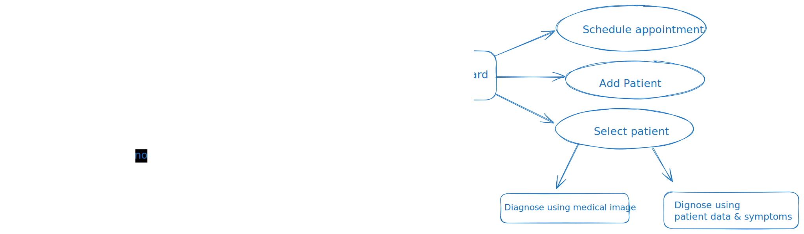
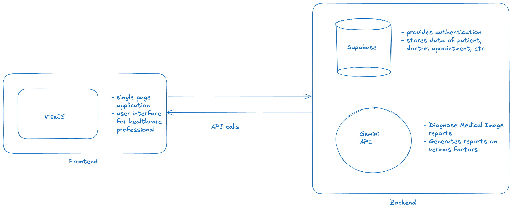

## 📌 **Project Overview**

Sahayak is an AI-powered diagnostic assistant designed to help healthcare professionals analyze **medical images, patient vitals, and symptoms** for **efficient and accurate diagnoses**. The application integrates **AI analysis, real-time patient management, and secure report generation** to enhance the workflow of medical practitioners.

---

## 🚀 **Features**

✅ **Medical Report Analysis** – Upload medical images (X-rays, MRIs, etc.) and get AI-powered summaries.  
✅ **Patient Data Analysis** – Enter patient vitals (Blood Pressure, Blood Sugar, BMI, Symptoms) for insights.  
✅ **AI-Based Disease Prediction** – Identify risk factors and potential diagnoses.  
✅ **PDF Report Generation** – Generate and download structured diagnostic reports.  
✅ **Patient Management** – Add, search, and filter patient records efficiently.  
✅ **Appointment Scheduling** – Doctors can schedule upcoming appointments.  
✅ **Google Authentication** – Secure login via Google.  
✅ **Data Privacy & Security** – Role-based access control and HIPAA-compliant encryption.

---

## 🛠 **Tech Stack**

- **Frontend:** Vite + React.js
- **Backend & Database:** Supabase
- **AI Model:** Gemini API (for medical analysis)
- **Authentication:** Google Sign-In
- **State Management:** React Context API
- **Styling:** Tailwind CSS
- **PDF Generation:** jsPDF
- **Deployment:** (Add your hosting details)

---

## 📂 **Project Structure**

```
📂 Sahayak
├── 📂 dist
├── 📂 node_modules
├── 📂 public
│   ├── _redirects
├── 📂 src
│   ├── 📂 components
│   │   ├── 📂 appointments
│   │   │   ├── ScheduleAppointmentModal.tsx
│   │   │   ├── UpcomingAppointments.tsx
│   │   ├── 📂 diagnostic
│   │   │   ├── DiagnosticTabs.tsx
│   │   │   ├── DiseasePredictorTab.tsx
│   │   │   ├── FilterModal.tsx
│   │   │   ├── HealthStatusButtons.tsx
│   │   │   ├── ReportSummaryTab.tsx
│   │   │   ├── VisitHistorySidebar.tsx
│   │   ├── 📂 layout
│   │   │   ├── AppLayout.tsx
│   │   ├── 📂 ui
│   │   │   ├── Button.tsx
│   │   │   ├── Input.tsx
│   │   │   ├── Select.tsx
│   │   │   ├── TextArea.tsx
│   │   │   ├── AddPatientModal.tsx
│   │   │   ├── ImageUpload.tsx
│   │   │   ├── ProtectedRoute.tsx
│   ├── 📂 contexts
│   │   ├── AuthContext.tsx
│   ├── 📂 lib
│   ├── 📂 pages
│   │   ├── AuthCallback.tsx
│   │   ├── DiagnosticTool.tsx
│   │   ├── DoctorDashboard.tsx
│   │   ├── LandingPage.tsx
│   │   ├── Login.tsx
│   │   ├── PatientDashboard.tsx
│   │   ├── Register.tsx
│   ├── App.tsx
│   ├── index.css
│   ├── main.tsx
│   ├── vite-env.d.ts
├── 📂 supabase
├── .env
├── .gitignore
├── eslint.config.js
├── index.html
├── package-lock.json
├── package.json
├── postcss.config.js
├── ReadMe
├── tailwind.config.js
├── tsconfig.app.json
├── tsconfig.json
├── tsconfig.node.json
├── vite.config.ts
```

---

## ⚙️ **Installation & Setup**

Follow these steps to set up the project locally:

1️⃣ **Clone the Repository**

```sh
git clone https://github.com/your-repo/sahayak.git
cd sahayak
```

2️⃣ **Install Dependencies**

```sh
npm install
```

3️⃣ **Set Up Environment Variables**  
Create a `.env` file in the root directory and add your Supabase and API keys. Example:

```
VITE_SUPABASE_URL=your_supabase_url
VITE_SUPABASE_ANON_KEY=your_anon_key
VITE_GEMINI_API_KEY=your_gemini_api_key
```

4️⃣ **Run the Application**

```sh
npm run dev
```

---

## 🔥 **Usage Guide**

1️⃣ **Login** using Google authentication.  
2️⃣ **Upload a medical report** or enter patient data.  
3️⃣ **View AI-generated analysis** with a summary of **vital signs, risk factors, and follow-up recommendations**.  
4️⃣ **Download the report** as a **PDF for sharing**.  
5️⃣ **Manage patients and schedule appointments** from the doctor dashboard.

---

## 📊 **Scalability & Performance**

- **Supports thousands of concurrent users** with efficient load balancing.
- **Real-time patient management** with Supabase's real-time sync.
- **Optimized AI calls** to ensure **low latency and fast response times**.

---

## 🔒 **Security & Compliance**

- **Role-Based Access Control (RBAC):** Ensures that only authorized users can access specific functionalities.
- **Data Encryption:** Patient data and medical reports are securely stored and encrypted in Supabase.
- **Authentication via Google Sign-In:** Secure and reliable authentication mechanism to prevent unauthorized access.
- **Protected Routes:** Implemented to restrict access to sensitive sections of the application.
- **Environment Variables:** API keys and sensitive configurations are stored securely using `.env` files.

---

Here’s how you can structure the **Diagrams** section in your README:

---

## 📊 **Diagrams**

### 🔄 **Workflow Diagram**

This diagram illustrates the end-to-end workflow of the application, from user interaction to AI analysis and report generation.



---

### 🏗 **System Architecture Diagram**

The following diagram represents the technical architecture of the application, showing key components and their interactions.

**Architecture Components:**

- **Frontend:** Vite + React.js (Handles UI and user interactions)
- **Backend & Database:** Supabase (Manages authentication and data storage)
- **AI Model:** Gemini API (Processes medical reports and patient data)
- **Authentication:** Google OAuth (Secure user login)
- **Storage & State Management:** Supabase real-time database



---

## 🚀 **Future Roadmap**

🔹 **Multi-Language Support** for wider adoption.  
🔹 **Integration with EHR Systems** for seamless data sharing.  
🔹 **More AI Enhancements** for deeper disease prediction.  
🔹 **Mobile App Version** for accessibility on the go.

---

## 🤝 **Contributing**

We welcome contributions! To contribute:  
1️⃣ **Fork the repository**  
2️⃣ **Create a feature branch** (`git checkout -b feature-name`)  
3️⃣ **Commit your changes** (`git commit -m "Added new feature"`)  
4️⃣ **Push to the branch** (`git push origin feature-name`)  
5️⃣ **Create a Pull Request**

---

## 📧 **Contact & Support**

For questions or support, reach out at **[divyaanshikaaushik@gmail.com](mailto:divyaanshikaaushik@gmail.com)** or create an issue in the **GitHub repository**.

---
